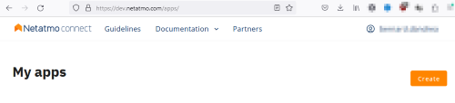
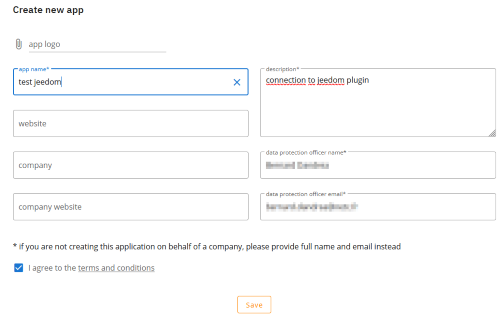
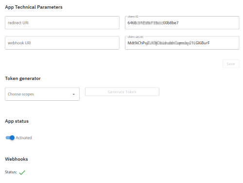
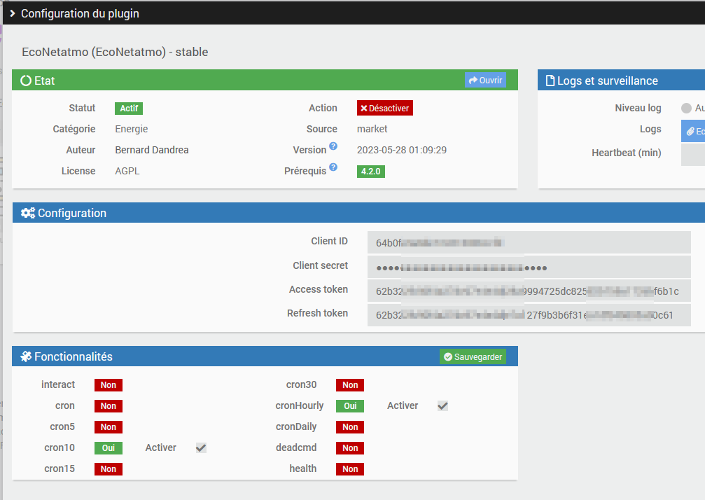
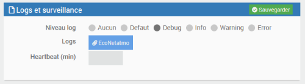
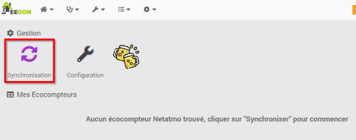
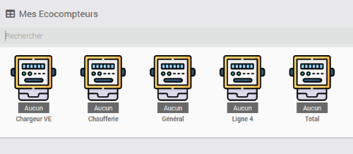
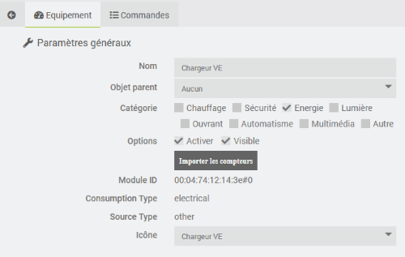
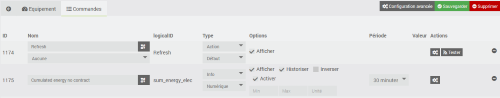
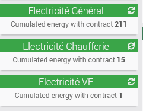

# Plugin EcoNetatmo

Plugin permettant de récupérer les consommations venant des Ecocompteurs Legrand type Drivia with NetAtmo (ref 41203x).

Ce plugin a été développé sur la base du plugin standard netatmoWeather.

Ce plugin utilise les API fournis par Netatmo ( voir le lien suivant <https://dev.netatmo.com/apidocumentation/control> ). 

# Récupération des informations de connexion

Pour accéder aux données de votre Ecocompteur, vous devez posséder un client\_id et un client\_secret générés sur le site <https://dev.netatmo.com>.

Si ce n'est déjà fait, créer un compte <https://auth.netatmo.com/fr-fr/access/signup?next_url=https%3A%2F%2Fdev.netatmo.com%2Fbusiness-showcase>

Une fois identifié, aller sur le menu des applications ( <https://dev.netatmo.com/apps/> ) puis cliquer sur 'Create'. 

Remplissez le formulaire et cliquer sur 'Save'.

Le 'client ID' et le 'client secret' sont générés. Vous pouvez les utiliser pour configurer le plugin.

# Configuration du plugin

Une fois le plugin installé, il faut l'activer et renseigner vos informations de connexion Netatmo :

-   **Client ID** : votre client ID (voir partie configuration)
-   **Client secret** : votre client secret (voir partie configuration)
-   **Nom d’utilisateur** : nom d’utilisateur de votre compte netatmo
-   **Mot de passe** : mot de passe de votre compte Netatmo

Vous pouvez activer le niveau de log Debug pour suivre l'activité du plugin et identifier les éventuels problèmes.

# Configuration des équipements

La configuration des équipements Netatmo est accessible à partir du menu du plugin (menu Plugins, Energie puis EcoNetAtmo) :

Cliquer sur Synchronisation pour lancer la création des équipements. L'API /homesdata est utilisée pour récuperer les informations (voir <https://dev.netatmo.com/apidocumentation/control#homesdata>).

Les compteurs des lignes électriques sont créés. Il y a un équipement par ligne. 

Vous retrouvez dans l'onglet 'Equipement' toute la configuration de votre équipement :

-   **Nom** : nom de votre compteur (celui-ci est repris de la configuration de Netatmo)
-   **Objet parent** : indique l’objet parent auquel appartient l’équipement
-   **Catégorie** : indique la catégorie Jeedom de l’équipement
-   **Activer** : permet de rendre votre équipement actif
-   **Visible** : le rend visible sur le dashboard
-   **Module ID** : indique l'identifiant unique de l’équipement chez Netatmo
-   **Consumption Type** : indique le type de votre équipement chez Netatmo
-   **Source Type** : indique la source d'énergie de votre équipement chez Netatmo
-   **Icone** : permet de sélectionner un type d'icône pour votre équipement dans le paneau de configuration
  
  Le bouton 'Importer les compteurs' permet de créer les commandes correspondant à l'équipement. Ceci est fait lors de la création de l'équipement et n'est utile que si vous avez supprimé une commande.

  

Vous retrouvez dans l'onglet 'Commandes' la liste des commandes (celles-ci sont générées lors de la création de l'équipement).

La commande action 'Refresh' permet de lancer la récupération immédiate des valeurs des compteurs. Par défaut, une récupération est lancée toutes les 10 minutes.

Les autres commandes correspondent aux compteurs renseignés par Netatmo (voir l'API /getmesure <https://dev.netatmo.com/apidocumentation/control#getmeasure> ). Pour chacun d'eux, on trouve en plus des valeurs habituelles de Jeedom : 

-   le nom affiché sur le dashboard
-   le logicalID qui correspond au 'type' dans l'API de Netatmo
-   la possibilité d'activer ou non la récupération du compteur
-   la période qui correspond au 'scale' dans l'API de Netatmo (pour laquelle on souhaite récupérer les données, seules les valeurs autorisées par l'API Netatmo sont présentées)

# Widget

Voici le widget standard. 

# FAQ

>**Quelle est la fréquence de rafraîchissement ?**
>
>Le plugin récupère les informations toutes les 10 minutes. Cependant, l'écocompoteur envoie ses relevés environ toutes les 3 heures aussi on peut observer ce décalage dans la récupération des données.

>**Puis-je récupérer les compteurs pour le gaz et l'eau ?**
>
>Le plugin est capable de le faire. Malheureusement, l'API de Netatmo ne spécifie pas quel est le 'type' à utiliser pour la récupération de ces valeurs. Une demande a été faite à l'équipe en charge du développement de l'API mais aucune réponse n'a encore été fournie.
